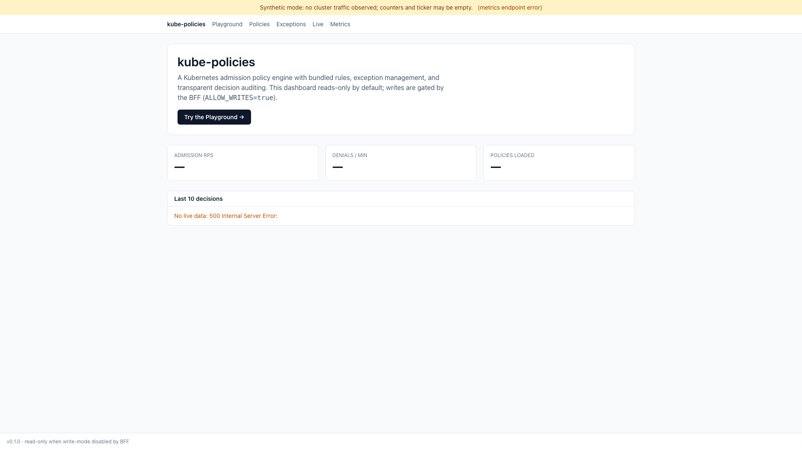

# Kube-Policies

Kube-Policies is a Kubernetes admission-control and policy-management reference
implementation. It combines an OPA/Rego policy engine, `Policy` and
`PolicyException` CRDs, a policy-manager API, a read-only dashboard, Helm
manifests, Prometheus/Grafana assets, and a reproducible demo pipeline.

[](LICENSE)
[](https://goreportcard.com/report/github.com/Jibbscript/kube-policies)
[](go.mod)
[](https://helm.sh/)

## Compliance & Security Posture

Kube-Policies is a **Proof-of-Concept / reference implementation**, not an authorized
production system. It is being driven to **FedRAMP-Moderate** (NIST SP 800-53 Rev 5) and
**CIS** readiness; it is **not yet authorized** (no ATO) and most security controls are
currently **Planned** or **Partial**. The honest, evidence-backed status — FIPS-199
categorization, control matrix, and POA&M of open weaknesses — lives in the compliance
package: [docs/compliance/](docs/compliance/README.md). To report a vulnerability, see
[SECURITY.md](SECURITY.md).

## Current Repo State

This repository is source-first. Install from the local chart in
`charts/kube-policies`; no published chart repository or external docs site is
required for the visitor path.

What is present today:

- `cmd/admission-webhook`: TLS 1.3 validating and mutating admission webhook on
  `:8443`, plus a separate Prometheus metrics server on `:9090`.
- `cmd/policy-manager`: REST API on `:8080`, metrics on `:9091`, CRD
  reconciliation for policies and exceptions, and a recent-decisions stream for
  dashboard consumers.
- `cmd/dashboard` and `web/`: Svelte dashboard served by a Go BFF. The dashboard
  is read-only by default; write verbs are blocked unless `ALLOW_WRITES=true`.
- `internal/policy`: OPA-backed evaluator with bundled default Pod guardrails,
  per-policy test evaluation, prepared-query caching, and fail-closed exception
  handling.
- `deployments/kubernetes/crds`: namespaced `Policy` and `PolicyException` CRDs.
- `charts/kube-policies`: Helm chart for the webhook, policy manager, optional
  dashboard, RBAC, services, config, persistence, and webhook TLS bootstrap.
- `monitoring/`: Prometheus, Grafana, and Alertmanager configuration aligned to
  the metrics emitted by the services.
- `demo/`: Kind capture scripts, tracked dashboard screenshots, and a 60-second
  Remotion video pipeline.
- `scripts/validate/manifests.sh`: offline validation for Helm render output,
  YAML, Prometheus, Alertmanager, Grafana JSON, and Kubernetes schemas.



## Features Backed By The Current Code

- Admission validation denies policy violations by default.
- Mutation responses can return JSON Patch operations when rules emit patches.
- Bundled default Pod rules cover privileged containers, `hostPath` volumes,
  `:latest` or implicit-latest images, and missing container security context.
- `Policy` CRDs are reconciled into the in-memory policy engine and manager
  registry.
- `PolicyException` CRDs can suppress matching violations while preserving
  attribution in `suppressed_by`, audit logs, and metrics.
- Exception registry errors preserve the original denial instead of applying an
  unsafe suppression.
- Runtime config validates key contracts: `policy.failure_mode` is
  `fail-open` or `fail-closed`, audit backend is `file` or `stdout`, and TLS
  minimum version is `1.3`.
- The dashboard proxies read paths and playground-style evaluation calls while
  blocking real writes by default.
- Demo fixtures and dashboard screenshots are tracked so visitors can inspect
  the product surface without running a cluster first.

## Quick Start For Visitors

```bash
git clone https://github.com/Jibbscript/kube-policies.git
cd kube-policies

# Fast behavior check used by the repo cleanup workflow.
TEST_COVERAGE=false make test-unit

# Build the two core service binaries.
make build

# Inspect the local Helm chart.
make helm-lint
helm template kube-policies charts/kube-policies --include-crds
```

For a live local walkthrough with Kind, Docker, Helm, kubectl, and openssl
installed:

```bash
make demo-up
# Open http://localhost:8090 after the target reports that the demo is up.
make demo-down
```

To regenerate and verify the 60-second video pipeline:

```bash
make demo
```

The rendered MP4 is written under `demo/dist/`, which is intentionally ignored.
The tracked capture manifest and screenshots live under
`demo/remotion/public/`.

## Deploying Your Own Images

The chart is local to this repository. Build and push images to a registry you
control, then point the chart at those images:

```bash
REGISTRY=ghcr.io/your-org IMAGE_TAG=v0.1.0 make docker-build docker-dashboard

helm dependency build charts/kube-policies
helm upgrade --install kube-policies charts/kube-policies \
  --namespace kube-policies-system \
  --create-namespace \
  --set admissionWebhook.image.registry=ghcr.io \
  --set admissionWebhook.image.repository=your-org/admission-webhook \
  --set admissionWebhook.image.tag=v0.1.0 \
  --set policyManager.image.registry=ghcr.io \
  --set policyManager.image.repository=your-org/policy-manager \
  --set policyManager.image.tag=v0.1.0 \
  --set dashboard.enabled=true \
  --set dashboard.image.repository=ghcr.io/your-org/dashboard \
  --set dashboard.image.tag=v0.1.0 \
  --wait
```

The webhook TLS chart notes are emitted after install. The chart supports
existing Secret preservation, inline PEM values, generated self-signed
certificates, and cert-manager-managed Secrets.

## Policy Authoring

Policies are namespaced CRDs in `policies.kube-policies.io/v1`. Rules are Rego
modules that expose `data.kube_policies.evaluate` and return an object with at
least `allowed`. When `allowed` is `false`, include `message` and `path` so the
API, audit stream, and dashboard can point at the offending field.

```yaml
apiVersion: policies.kube-policies.io/v1
kind: Policy
metadata:
  name: security-baseline
  namespace: kube-policies-system
spec:
  description: "Basic Pod security requirements"
  enabled: true
  severity: HIGH
  rules:
    - name: no-privileged-containers
      severity: HIGH
      rego: |
        package kube_policies

        import rego.v1

        default evaluate := {"allowed": true}

        evaluate := {
          "allowed": false,
          "message": "Container must not run in privileged mode",
          "path": sprintf("spec.containers[%d].securityContext.privileged", [i]),
        } if {
          indexes := [j |
            some j
            input.object.spec.containers[j].securityContext.privileged == true
          ]
          count(indexes) > 0
          i := indexes[0]
        }
```

The full sample policy is in
[`examples/policies/security-baseline.yaml`](examples/policies/security-baseline.yaml).

## Exception Management

A `PolicyException` grants a scoped carve-out from a policy violation. Matching
exceptions suppress otherwise-denied verdicts, but the suppression remains
visible through:

- `EvaluationResult.suppressed_by`
- audit log `suppressed_by`
- dashboard decision events
- `kube_policies_policy_exception_suppressions_total{policy_id, rule_id}`

```yaml
apiVersion: policies.kube-policies.io/v1
kind: PolicyException
metadata:
  name: emergency-deployment-latest-tag
  namespace: production
spec:
  policy_id: security-baseline
  rule_id: no-latest-image-tag
  justification: "Temporary emergency deployment while an immutable image is promoted"
  approver: security-oncall
  expires_at: "2030-01-01T00:00:00Z"
  scope:
    namespaces: ["production"]
    resources: ["pods", "deployments"]
    groups: ["system:serviceaccounts:production"]
```

Use the bundled policy id, such as `security-baseline`, when suppressing a
bundled default rule. For CRD-authored policies, the reconciler stores the
internal policy id as `crd:<namespace>:<name>`.

Exception propagation is eventually consistent. The webhook watches
`PolicyException` resources through controller-runtime, so there can be a short
window between `kubectl apply` and every webhook replica honoring the new
exception. Re-apply the affected workload after a short pause, or wait for
`status.phase=Active` on the exception before proceeding.

Scope semantics are security-sensitive:

- An absent `scope` matches every request for the named policy and rule.
- An empty list inside a present `scope` leaves that dimension unconstrained.
- Rule id is exact when set; an empty rule id applies to every rule in the
  policy.
- Resource matching is case-insensitive plural matching. Namespace, user, and
  group matching are case-sensitive.

See
[`examples/exceptions/emergency-deployment.yaml`](examples/exceptions/emergency-deployment.yaml)
for the tracked sample.

## Dashboard

The dashboard is a Svelte 5 SPA served by `cmd/dashboard`. It provides:

- overview tiles from scraped policy-manager and webhook metrics
- live and recent admission decisions
- policy and exception views
- a playground that submits policy test and validation requests
- a read-only default posture enforced by the Go BFF

Useful commands:

```bash
make ui-deps
make ui-test
make ui-lint
make ui-build
NO_UI=1 make build-dashboard
```

Use `make ui-dev` for local SPA development. It runs `cmd/dashboard` on
`:8091` and Vite on `:5173`.

## Verification Commands

High-signal checks for this repository:

```bash
TEST_COVERAGE=false make test-unit
make test-integration
make test-e2e
make helm-lint
make validate-manifests
make ui-test
make ui-lint
make demo-verify
```

`make validate-manifests` expects `helm`, `yq`, `jq`, `promtool`, `amtool`, and
`kubeconform` on `PATH`.

## Repository Layout

```text
cmd/
  admission-webhook/   TLS admission webhook and co-located CRD watchers
  policy-manager/      REST API, CRD reconcilers, metrics, decision stream
  dashboard/           Go BFF and embedded SPA host
internal/
  admission/           AdmissionReview handlers and audit/metrics plumbing
  audit/               Structured audit events and public decision events
  config/              Viper-backed config loader and runtime validation
  metrics/             Prometheus collectors
  policy/              OPA evaluator, default rules, exception suppression
  policymanager/       API handlers, CRD conversion, controller setup
web/                   Svelte dashboard SPA
charts/kube-policies/  Helm chart
deployments/           Raw Kubernetes manifests and CRDs
monitoring/            Prometheus, Grafana, and Alertmanager assets
examples/              Policy and PolicyException manifests
demo/                  Kind capture, Remotion render, and demo verification
test/                  Integration and end-to-end suites
scripts/               Test, certificate, logger, and manifest validation tools
```

## Documentation

- [Configuration reference](docs/configuration.md)
- [Deployment guide](DEPLOYMENT.md)
- [Testing guide](TESTING.md)
- [Contributing guide](CONTRIBUTING.md)
- [Changelog](CHANGELOG.md)
- [Dashboard README](web/README.md)
- [Demo verification scripts](demo/verify/)

## Acknowledgments

This project is inspired by
[Block's Kube-Policies guardrails write-up](https://developer.squareup.com/blog/kube-policies-guardrails-for-apps-running-in-kubernetes/)
and builds on Open Policy Agent, Kubernetes admission controllers, Prometheus,
Grafana, Svelte, and Remotion.

## License

Apache License 2.0. See [LICENSE](LICENSE).
