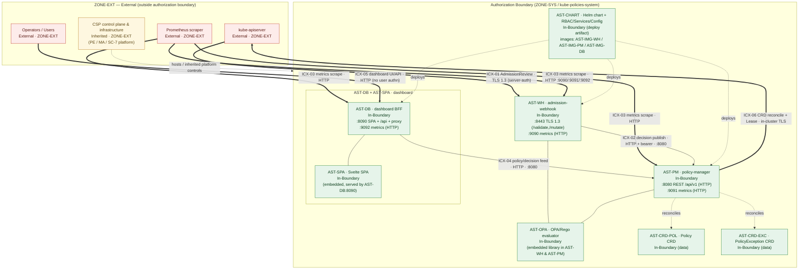

# Authorization Boundary — Kube-Policies (KP)

This diagram delineates the authorization boundary for the Kube-Policies (KP) system,
categorized **FIPS-199 Moderate** (NIST SP 800-53 Rev 5 / FedRAMP Moderate baseline).
It is the authoritative visual companion to the [System Facts Sheet](../system-facts.md)
and is referenced from the [SSP](../ssp/SSP.md). Every component, asset ID, port, and trust
zone uses the canonical identifiers from the facts sheet verbatim.

The data movements crossing this boundary (`ICX-01..06`) are detailed in the
[Data Flow Diagram](data-flow.md) and enumerated in the
[Interconnection Register](../interconnections.md).

**Annual review.** This artifact is reviewed at least annually (next review **2027-05-29**)
and whenever the boundary, components, or interconnections materially change.

## Boundary classification

All authorization-boundary components are deployed by the Helm chart (`AST-CHART`) into a
single Kubernetes namespace (`kube-policies-system`) on a customer/CSP-provided cluster
(`ZONE-SYS`). Everything that the system depends on but does not control — the kube-apiserver,
the Prometheus scraper, cluster operators/users, and the hosting CSP control plane and
infrastructure — is **External** and sits in `ZONE-EXT`.

| Asset ID | Component | Classification | Rationale |
|---|---|---|---|
| `AST-WH` | admission-webhook (`:8443` TLS 1.3, `:9090` metrics) | **In-Boundary** | KP-owned Go service in `kube-policies-system`. |
| `AST-PM` | policy-manager (`:8080` REST, `:9091` metrics) | **In-Boundary** | KP-owned Go service in `kube-policies-system`. |
| `AST-DB` | dashboard BFF (`:8090` SPA/API/proxy, `:9092` metrics) | **In-Boundary** | KP-owned Go service in `kube-policies-system`. |
| `AST-SPA` | Svelte dashboard SPA | **In-Boundary** | Static assets embedded in and served by `AST-DB:8090`. |
| `AST-OPA` | OPA/Rego policy evaluator | **In-Boundary** | Embedded Go library inside `AST-WH` and `AST-PM`. |
| `AST-CRD-POL` | `Policy` CRD | **In-Boundary** (data) | Namespaced config/policy data, stored by kube-apiserver but owned/reconciled by KP. |
| `AST-CRD-EXC` | `PolicyException` CRD | **In-Boundary** (data) | Namespaced config/policy data, stored by kube-apiserver but owned/reconciled by KP. |
| `AST-CHART` | Helm chart + RBAC/Services/Config | **In-Boundary** | KP deployment artifact that defines the boundary footprint. |
| `AST-IMG-WH` | `admission-webhook` image (distroless) | **In-Boundary** | KP build artifact backing `AST-WH`. |
| `AST-IMG-PM` | `policy-manager` image (distroless) | **In-Boundary** | KP build artifact backing `AST-PM`. |
| `AST-IMG-DB` | `dashboard` image | **In-Boundary** | KP build artifact backing `AST-DB`/`AST-SPA`. |
| kube-apiserver | Kubernetes API server | **External** (`ZONE-EXT`) | Provided by the customer/CSP cluster; KP integrates via webhook + CRD reconcile. |
| Prometheus | Metrics scraper | **External** (`ZONE-EXT`) | Customer-operated; scrapes KP metrics endpoints. |
| Operators/Users | Cluster operators and users | **External** (`ZONE-EXT`) | Human actors consuming the dashboard/API. |
| CSP control plane / infrastructure | Hosting cloud provider | **Inherited** (`ZONE-EXT`) | Underlying platform; PE/MA/SC-7 platform controls are **inherited** from the CSP. |

> **Inherited controls.** KP runs as a tenant on a customer/CSP-provided Kubernetes cluster.
> Physical/environmental (PE), media protection (MA), and the network/host platform underpinning
> SC-7 are **inherited** from the hosting CSP and are not implemented within the KP boundary.
> See the [control matrix](../control-matrix.csv) for the responsible-party split.

## Diagram

**Legend.** Green = **In-Boundary** (KP-owned, inside `ZONE-SYS`); red = **External**
(`ZONE-EXT`, not controlled by KP); amber = **Inherited** (CSP-provided platform controls).
Bold/`==>` edges crossing the boundary are external interconnections `ICX-01`, `ICX-03`,
`ICX-05`, and `ICX-06`; thin edges are internal data movements (`ICX-02`, `ICX-04`) and
embedded/deploy relationships.

## Notes on current vs. target posture

- `AST-WH:8443` terminates **TLS 1.3** today but performs **server-auth only**; apiserver
  mTLS is a phase **P3** target.
- All metrics planes (`:9090/:9091/:9092`) and the REST/dashboard planes
  (`:8080/:8090`) are currently **HTTP and unauthenticated**; TLS + authn/OIDC are phase
  **P2/P3** targets. These are tracked in the [POA&M](../poam.csv).
- CRD-stored policy/exception data (`AST-CRD-POL`, `AST-CRD-EXC`) is persisted by the
  external kube-apiserver but is classified **In-Boundary (data)** because KP owns its
  schema and reconciliation; the cluster's storage/etcd protections are **Inherited**.
