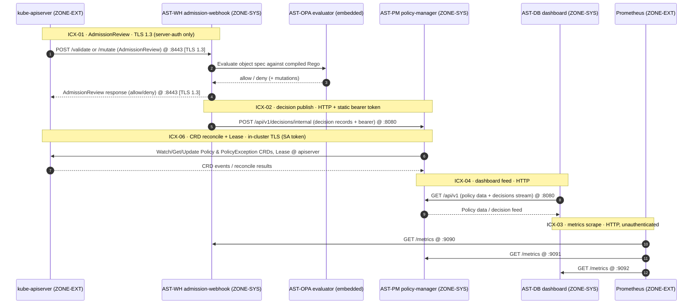
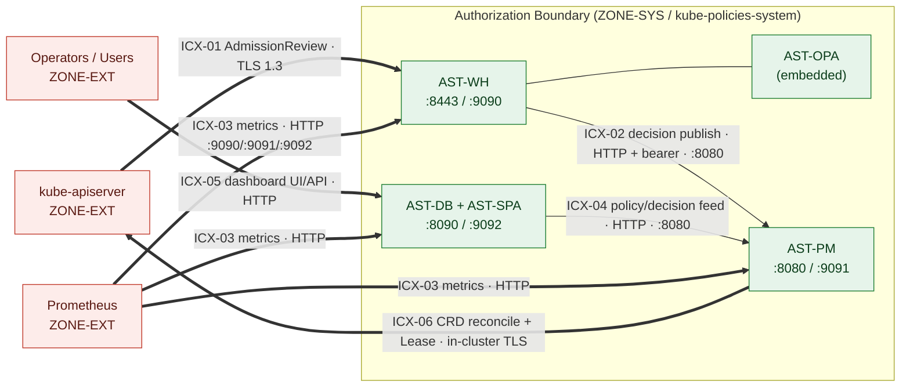

# Data Flow — Kube-Policies (KP)

This diagram shows the runtime data flows for the Kube-Policies (KP) system
(**FIPS-199 Moderate**; NIST SP 800-53 Rev 5 / FedRAMP Moderate baseline). It is the
companion to the [Authorization Boundary Diagram](authorization-boundary.md) and uses the
canonical asset IDs, ports, and interconnection IDs (`ICX-01..06`) from the
[System Facts Sheet](../system-facts.md). Each interconnection is enumerated with sensitivity
and protection in the [Interconnection Register](../interconnections.md). Referenced from the
[SSP](../ssp/SSP.md).

**Annual review.** This artifact is reviewed at least annually (next review **2027-05-29**)
and whenever a data flow or interconnection materially changes.

## Sequence — admission, decision publish, reconcile, dashboard, metrics

## Flow overview (boundary crossings highlighted)

## Annotations

- **`ICX-01` (apiserver → `AST-WH:8443`)** — AdmissionReview request/response. Transport is
  **TLS 1.3** (server-auth only today; apiserver mTLS is a phase **P3** target). This is the
  only flow with transport encryption in the current build.
- **`AST-WH` → `AST-OPA`** — in-process Rego evaluation (embedded library; no network hop).
- **`ICX-02` (`AST-WH` → `AST-PM:8080`)** — admission decision records published to
  `/api/v1/decisions/internal` over **HTTP with a static bearer token**; TLS + audience-bound
  token is a phase **P3/P4** target.
- **`ICX-06` (`AST-PM` ↔ kube-apiserver)** — `Policy`/`PolicyException` reconcile plus leader-
  election Lease over the in-cluster kubeconfig/SA token (TLS to apiserver); least-privilege SA
  is a phase **P3** target.
- **`ICX-04` (`AST-DB` → `AST-PM:8080`)** — dashboard pulls policy data and the decision feed
  over **HTTP**; TLS is a phase **P4** target.
- **`ICX-03` (Prometheus → `:9090/:9091/:9092`)** — operational metrics scraped over
  **unauthenticated HTTP**; TLS + authn is a phase **P3** target.
- **`ICX-05` (Operators/Users → `AST-DB:8090`)** — dashboard UI/API over **HTTP with no user
  authentication** (writes gated by `ALLOW_WRITES`); TLS + OIDC login is a phase **P3** target.

Current-vs-target transport posture and remediation phases are tracked in the
[Interconnection Register](../interconnections.md) and the [POA&M](../poam.csv).
