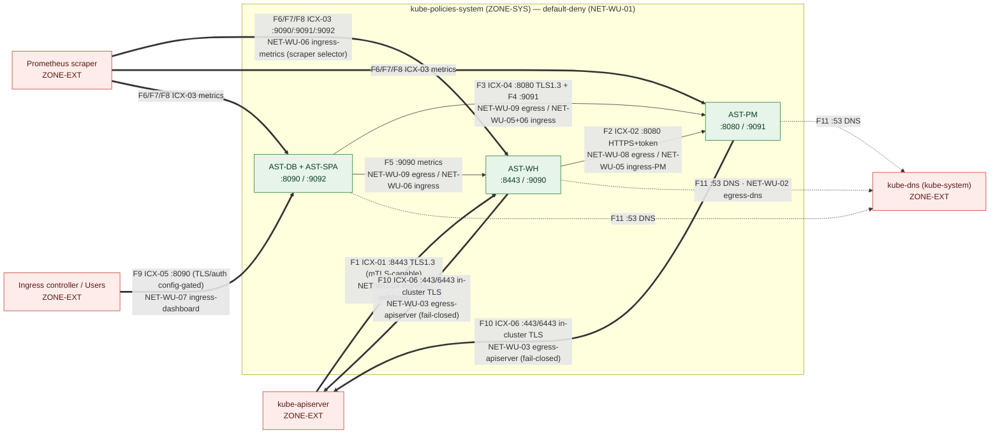

# Network Boundary & Segmentation Architecture — Kube-Policies (KP)

This document is the **SC-7 (Boundary Protection)** narrative and the **CA-3 (Information
Exchange)** scoped-flow record for the Kube-Policies system (KP), categorized **FIPS-199
Moderate** under **NIST SP 800-53 Rev 5** (FedRAMP **Moderate** baseline). It describes the
network trust zones, enumerates **every** allowed network flow with its port / protocol /
encryption posture, and **maps each flow to the specific shipped NetworkPolicy template**
(and the default-deny baseline that blocks everything else). It complements the
[security architecture (PL-8)](security-architecture.md), reuses the interconnection IDs
(`ICX-01..06`) from the [interconnection register](interconnections.md), and is consistent
with the [authorization-boundary diagram](diagrams/authorization-boundary.md) and the
[data-flow diagram](diagrams/data-flow.md). Per-control status is in the
[control matrix](control-matrix.csv); open weaknesses in the [POA&M](poam.csv).

**Annual review.** This document is reviewed at least **annually** (next review
**2027-06-01**) and whenever the network segmentation design, the allowed-flow set, the
NetworkPolicy templates, the listening ports, or the interconnections materially change.

> **Honesty note — read §6 before relying on this for an assessment.** The NetworkPolicy
> objects described here are **rendered by the Helm chart and require a NetworkPolicy-enforcing
> CNI (Calico, Cilium, Antrea, …) to take effect**. On the default kind `kindnet` CNI, or any
> CNI that does not implement the `networking.k8s.io/v1` NetworkPolicy API, these objects are
> **inert** — they install but enforce nothing. This is a hard prerequisite, not a guarantee.
> Several allow-flows are also **fail-closed-until-configured** (operator must set
> apiserver/ingress CIDRs) and the ResourceQuota/LimitRange availability controls are
> **off by default**. KP has **no ATO**; nothing here is an assessment result. The designed
> live kind end-to-end proof is now implemented and has been **executed live** on an
> enforcing CNI (Calico) via `scripts/test/test-netpol-e2e.sh` (see §7.1) — a passing
> developer/e2e proof, **not** an accredited assessment result.

## 1 Intent and design

KP enforces network segmentation through a **default-deny baseline plus a minimum
least-privilege allow-list** for the `kube-policies-system` namespace. The design realizes:

- **SC-7 / SC-7(5) — Deny-by-default, allow-by-exception.** A `podSelector:{}`
  NetworkPolicy declares both `Ingress` and `Egress` policy types with **no** allow rules,
  so all east-west and north-south traffic to/from every KP pod is denied unless an explicit
  allow policy below permits it.
- **SC-7 / SC-7(3) — Managed, minimal access points.** Each component is reachable on only
  the single serving port it needs, and only from the specific peer that legitimately calls
  it (apiserver → webhook `:8443`; webhook+dashboard → policy-manager `:8080`; scraper →
  metrics; ingress controller → dashboard `:8090`).
- **SC-7(4) / SC-7(7) — Scoped, deny-by-default egress (split-tunnel prevention).** Egress is
  enumerated and constrained to exactly DNS (`kube-dns:53`), the kube-apiserver (operator-set
  CIDRs), and the in-namespace internal hop (webhook→policy-manager, dashboard→policy-manager
  + webhook). There is no allow-all / `0.0.0.0/0` egress, so a compromised pod cannot freely
  exfiltrate or split-tunnel to arbitrary external destinations.
- **SC-5 — Denial-of-service protection** is enforced at the application layer (rate limiting,
  body caps, concurrency/stream caps) and, optionally, by namespace ResourceQuota/LimitRange;
  see §5.

Segmentation is delivered by two interchangeable paths that render the **same** policy set:
the **Helm chart** (`charts/kube-policies/templates/networkpolicy-*.yaml`, gated on
`networkPolicy.enabled`, default `true`) and a **static base manifest**
(`deployments/kubernetes/base/networkpolicy.yaml`, IAM-WU-15) for the raw `kubectl apply`
install path.

## 2 Trust zones

Consistent with the [authorization-boundary diagram](diagrams/authorization-boundary.md) and
[system facts](system-facts.md):

- **`ZONE-EXT`** (outside the boundary): kube-apiserver, the Prometheus scraper, cluster
  operators/users (via an ingress controller), and the hosting CSP control plane.
- **`ZONE-SYS`** (inside the boundary): the `kube-policies-system` namespace workloads
  (`AST-WH`, `AST-PM`, `AST-DB`/`AST-SPA`, embedded `AST-OPA`).

The CNI/network platform that **enforces** NetworkPolicy is **Inherited** from the cluster:
KP authors the policy objects but does not implement the dataplane that enforces them. This
inheritance is the crux of §6.

## 3 Allowed-flow register (every permitted flow → NetworkPolicy template)

The table below enumerates **every** flow the allow-list permits. Anything not listed is
**denied** by the default-deny baseline (`networkpolicy-default-deny.yaml`, NET-WU-01). The
"Encryption posture" column states the transport actually shipped (cross-referenced to the
TLS work verified in P2/P3 — see [SC-policy §4](policies/SC-policy.md)); the NetworkPolicy is
a network-layer access control and does **not** itself provide encryption.

| # | Flow (From → To) | Port/Proto | Encryption posture (shipped) | ICX | NetworkPolicy template (work unit) | Direction |
|---|---|---|---|---|---|---|
| F1 | kube-apiserver (`ZONE-EXT`) → `AST-WH` | `8443/tcp` | TLS 1.3; webhook **requires+verifies apiserver client cert** when the binary's `--require-client-cert` (default **true**) is paired with a client-CA bundle — chart value `requireClientCert` ships **false** for dev (§6) | `ICX-01` | `networkpolicy-ingress-webhook.yaml` (**NET-WU-04**) — ingress `:8443`, `from` = `networkPolicy.webhook.ingressFrom` (ipBlocks/namespaceSelectors); **fail-closed when empty** | Ingress (EXT→SYS) |
| F2 | `AST-WH` → `AST-PM` | `8080/tcp` | **HTTPS, verified** (RootCAs; no `InsecureSkipVerify`); audience-bound projected-SA token via TokenReview — verified from P3 | `ICX-02` | `networkpolicy-egress-internal.yaml` (**NET-WU-08**) egress + `networkpolicy-ingress-policy-manager.yaml` (**NET-WU-05**) ingress | Internal (SYS↔SYS) |
| F3 | `AST-DB` → `AST-PM` | `8080/tcp` (API/SSE) | TLS 1.3 upstream (verified from P2) | `ICX-04` | `networkpolicy-egress-dashboard.yaml` (**NET-WU-09**) egress + `networkpolicy-ingress-policy-manager.yaml` (**NET-WU-05**) ingress | Internal (SYS↔SYS) |
| F4 | `AST-DB` → `AST-PM` | `9091/tcp` (PM metrics) | HTTP, or TLS 1.3 + bearer when `metrics.tls.enabled` (config-gated) | `ICX-03`/internal | `networkpolicy-egress-dashboard.yaml` (**NET-WU-09**) egress + `networkpolicy-ingress-metrics.yaml` (**NET-WU-06**, PM `:9091`) ingress | Internal (SYS↔SYS) |
| F5 | `AST-DB` → `AST-WH` | `9090/tcp` (WH metrics) | HTTP, or TLS 1.3 + bearer when `metrics.tls.enabled` (config-gated) | `ICX-03`/internal | `networkpolicy-egress-dashboard.yaml` (**NET-WU-09**) egress + `networkpolicy-ingress-metrics.yaml` (**NET-WU-06**, WH `:9090`) ingress | Internal (SYS↔SYS) |
| F6 | Prometheus (`ZONE-EXT`) → `AST-WH` | `9090/tcp` | HTTP (TLS 1.3 + bearer when `metrics.tls.enabled`) | `ICX-03` | `networkpolicy-ingress-metrics.yaml` (**NET-WU-06**) — `from` = `networkPolicy.metricsScraperSelector` (namespace **AND** pod selector) | Ingress (EXT→SYS) |
| F7 | Prometheus (`ZONE-EXT`) → `AST-PM` | `9091/tcp` | HTTP (TLS 1.3 + bearer when `metrics.tls.enabled`) | `ICX-03` | `networkpolicy-ingress-metrics.yaml` (**NET-WU-06**) — scraper selector | Ingress (EXT→SYS) |
| F8 | Prometheus (`ZONE-EXT`) → `AST-DB` | `9092/tcp` | HTTP (TLS-gated on `dashboard.tls.enabled`; not bearer-authenticated — tracked gap) | `ICX-03` | `networkpolicy-ingress-metrics.yaml` (**NET-WU-06**) — scraper selector | Ingress (EXT→SYS) |
| F9 | Operators/Users via ingress controller (`ZONE-EXT`) → `AST-DB` | `8090/tcp` | HTTP in-pod; optional in-pod TLS 1.3 + HSTS when `DASHBOARD_TLS_ENABLED` (config-gated, off by default); user auth via `DASHBOARD_AUTH_MODE` (config-gated, off by default) | `ICX-05` | `networkpolicy-ingress-dashboard.yaml` (**NET-WU-07**) — `from` = `networkPolicy.dashboard.ingressFrom` (default `ingress-nginx` namespace) | Ingress (EXT→SYS) |
| F10 | `AST-WH` + `AST-PM` → kube-apiserver (`ZONE-EXT`) | `443`/`6443/tcp` | In-cluster TLS (SA token); used for leader election + TokenReview | `ICX-06` | `networkpolicy-egress-apiserver.yaml` (**NET-WU-03**) — `to` = `networkPolicy.apiServerCIDRs` ipBlocks on `apiServerPorts`; **fail-closed when empty** | Egress (SYS→EXT) |
| F11 | All KP pods → kube-dns (`kube-system`) | `53/udp`, `53/tcp` | DNS (plaintext; cluster DNS) | n/a | `networkpolicy-egress-dns.yaml` (**NET-WU-02**) — `to` = `kube-system` ns + `k8s-app=kube-dns` pod | Egress (SYS→EXT-ish) |

**Everything else is denied** by `networkpolicy-default-deny.yaml` (**NET-WU-01**), which
selects every pod (`podSelector:{}`) and declares `Ingress`+`Egress` with no allow rules.

### 3.1 Gating and rendering notes (honest)

- **Per-component gating.** Each allow policy is gated on the relevant component's `enabled`
  flag (e.g. the dashboard egress/ingress only render when `dashboard.enabled=true`; the
  internal webhook→PM egress requires both `admissionWebhook.enabled` **and**
  `policyManager.enabled`), so a policy never points at a peer that does not exist. With the
  dashboard enabled this renders **11 NetworkPolicy objects** (the metrics template emits one
  object per enabled component).
- **Fail-closed-until-configured.** `networkpolicy-egress-apiserver.yaml` (F10) and
  `networkpolicy-ingress-webhook.yaml` (F1) render **with no peers** when
  `apiServerCIDRs` / `webhook.ingressFrom` are empty (the shipped defaults). That is
  intentional fail-closed behavior — leader election, TokenReview, and admission will **fail**
  until the operator sets the control-plane CIDRs. `NOTES.txt` warns on install. We
  deliberately do **not** fall back to `0.0.0.0/0`.
- **Static base manifest.** `deployments/kubernetes/base/networkpolicy.yaml` mirrors the same
  set for the raw-manifest install path, selecting pods by the stable `component` label. Its
  `egress-apiserver` ships a **placeholder** `10.96.0.1/32` and its `ingress-webhook` ships
  **fail-closed** (no `from`), both to be tuned per cluster.
- **Namespace Pod Security Admission.** The optional `namespace.yaml` (**NET-WU-19**, gated on
  `namespace.create`, default `false`) labels the namespace `restricted` on enforce/audit/warn
  — a complementary CM-6/SC-7 hardening, not a NetworkPolicy.

## 4 Network-flow diagram



**Legend.** Bold `==>` edges cross the authorization boundary (`ZONE-EXT ↔ ZONE-SYS`); thin
`-->` edges are internal SYS↔SYS flows; dashed `-.->` edges are DNS egress. Each label names
the flow ID (F1..F11), the interconnection (`ICX-*`), the port/transport, and the
NetworkPolicy work unit that permits it. All edges not drawn are denied by NET-WU-01.

## 5 SC-5 — Denial-of-service protection (application + namespace)

NetworkPolicy constrains *who* may connect; SC-5 protects against *volume*. Both ship:

- **Per-replica application rate limiting (NET-WU-14/15, RES-WU-17).**
  `internal/middleware/ratelimit.go` mounts a token-bucket limiter (default **50 rps / burst
  100**), a non-blocking max-in-flight **concurrency cap (100)** → `429`, a request **body cap
  (3 MiB)** → `413`, and a separate **SSE stream-connection cap (100)** → `429`. Limits are
  **per pod**, so the cluster-wide ceiling is roughly `limit × replicaCount`. Rejections are
  observable on the metric `kube_policies_http_rate_limited_total{handler,reason}` (reasons:
  `rate`, `concurrency`, `body_too_large`, `stream_capacity`). Configured via `rateLimit.*`
  (default **on**).
- **Bounded controller concurrency.** `MaxConcurrentReconciles` is bounded (default **2**) so a
  burst of CRD churn cannot exhaust the policy-manager.
- **Optional namespace ResourceQuota + LimitRange (RES-WU-17).** `resourceQuota` and
  `limitRange` cap aggregate/per-container compute. **Both ship OFF by default** because a
  mis-sized quota can block the chart's own pods from scheduling; operators size and enable
  them per topology.
- **Fail-closed admission** complements SC-5: a webhook overload denies rather than silently
  admits at the enforced boundary.

> **Design note — SSE stream gate ordering.** On the decisions stream the
> connection cap is applied *before* the service-token auth check, so an over-cap
> connection is rejected without a TokenReview round-trip (avoiding TokenReview
> amplification under load). The residual is that slot *acquisition* precedes
> identity verification; this is bounded because `networkpolicy-ingress-policy-manager.yaml`
> (NET-WU-05) already scopes `:8080` to the admission-webhook and dashboard
> components only, so reaching the stream requires an already-in-segment peer. A
> rejected-at-auth request releases its slot immediately, so this is transient
> churn, not a leak.

## 6 Current vs. target / honesty section (do not overstate)

| Aspect | Shipped (as-built) | Caveat / residual risk |
|---|---|---|
| Default-deny + least-privilege allow-list | **Rendered** by the Helm chart and the static base manifest (11 objects with dashboard on) | **Requires a NetworkPolicy-enforcing CNI** (Calico/Cilium/Antrea). On kindnet or a non-enforcing CNI the objects are **inert** — no enforcement. Verify per §7. |
| apiserver egress (F10) / webhook ingress (F1) | Templates render fail-closed | **Fail-closed-until-configured**: empty `apiServerCIDRs` / `webhook.ingressFrom` (shipped defaults) deny the flow; the operator **must** set control-plane CIDRs or leader election / TokenReview / admission break. |
| Webhook apiserver mTLS (F1) | Binary `--require-client-cert` defaults **true** (fail-closed); enforced when paired with a client-CA bundle | Chart value `admissionWebhook.tls.requireClientCert` defaults **false** for dev/turnkey installs (kind/ct/demo). Production must set it **true** + supply `clientCA`. apiserver-side presentation of a client cert also depends on cluster config (P3 target). |
| Management/internal TLS (F2/F3) | Verified from P2/P3: webhook→PM uses **verified HTTPS** (RootCAs, no `InsecureSkipVerify`, audience-bound token); PM serves **TLS 1.3**; dashboard upstreams verified | Not new P4 work — cited here for completeness; do not re-claim as P4 deliverables. |
| Dashboard in-pod TLS + user auth (F9) | Optional in-pod TLS 1.3 + HSTS (`DASHBOARD_TLS_ENABLED`) and user auth (`DASHBOARD_AUTH_MODE`) | **Both config-gated and OFF by default.** The shipped default dashboard is plaintext-in-pod with no user auth; mark **Partial / config-dependent**. |
| Metrics auth (F6/F7/F8) | Optional TLS 1.3 + bearer on WH/PM metrics (`metrics.tls.enabled`); dashboard `/metrics` TLS-gated only | Default is **unauthenticated HTTP**; dashboard `/metrics` is never bearer-authenticated (tracked gap). |
| ResourceQuota / LimitRange (SC-5) | Templates ship | **OFF by default** (`resourceQuota.enabled` / `limitRange.enabled` = false). |
| Live kind end-to-end enforcement proof | **Implemented + executed live** — `scripts/test/test-netpol-e2e.sh` / `make test-netpol-e2e` (see §7.1) | Ran green on Calico `v3.28.2` / kind `v1.31.2`: attacker→PM:8080 BLOCKED, webhook→PM:8080 ALLOWED, DNS OK, default-deny egress holds. Requires an enforcing CNI; a passing dev/e2e proof, **not** an ATO. |

## 7 Verification (CIS 5.3.1 / 5.3.2)

The end-to-end proof on a NetworkPolicy-enforcing CNI (now implemented as
`scripts/test/test-netpol-e2e.sh` — see §7.1 for the runnable, executed version):

1. **Confirm the CNI enforces NetworkPolicy.** On Calico/Cilium/Antrea this is supported; on
   kindnet it is not. A quick functional probe:
   ```console
   # In a throwaway namespace, deny-all then prove a curl is blocked:
   kubectl create ns np-test
   kubectl -n np-test run a --image=busybox --restart=Never -- sleep 3600
   kubectl -n np-test run b --image=busybox --restart=Never -- sleep 3600
   kubectl -n np-test apply -f - <<'EOF'
   apiVersion: networking.k8s.io/v1
   kind: NetworkPolicy
   metadata: { name: deny-all, namespace: np-test }
   spec: { podSelector: {}, policyTypes: [Ingress, Egress] }
   EOF
   # With an enforcing CNI this MUST fail (timeout); on kindnet it will SUCCEED (no enforcement):
   kubectl -n np-test exec a -- wget -qO- --timeout=3 http://$(kubectl -n np-test get pod b -o jsonpath='{.status.podIP}') || echo "blocked (expected on enforcing CNI)"
   kubectl delete ns np-test
   ```
2. **Install with NetworkPolicy enabled and CIDRs set**, then assert the 11 objects render and
   that a cross-namespace probe to `AST-PM:8080` from outside the allow-list is denied while
   the apiserver→`:8443` and scraper→metrics flows succeed.
3. **Negative check:** with `apiServerCIDRs` empty, confirm apiserver egress is denied
   (fail-closed) and the `NOTES.txt` warning is emitted.

Until this is executed on an enforcing CNI in CI/e2e, segmentation is reported as
**Implemented (Helm) — requires enforcing CNI; live proof pending**, never as
"enforced by default".

### 7.1 Implemented live proof — `scripts/test/test-netpol-e2e.sh` (P4 exit gate)

The designed proof above is now implemented as a runnable, self-contained script
(`make test-netpol-e2e` → `scripts/test/test-netpol-e2e.sh`). It does NOT use the
default kindnet harness (`test-kind.sh`), which cannot enforce NetworkPolicy.
Instead it stands up its own kind cluster with `disableDefaultCNI: true`, installs
**Calico** (a NetworkPolicy-enforcing dataplane), waits for `calico-node` Ready, then:

1. Deploys trivial `agnhost` pods carrying the **exact** labels the chart policies
   select: a `policy-manager` server (`app.kubernetes.io/{name=kube-policies,
   instance=kp, component=policy-manager}`, listening on `:8080`), a `webhook-client`
   (`component=admission-webhook`), and an out-of-selector `attacker` (foreign labels).
2. **Negative control:** before any policy, proves `attacker → policy-manager:8080`
   is **OPEN** (so a later BLOCK is attributable to the policy, not broken plumbing).
3. Renders and applies **only** the `networkpolicy-*.yaml` templates into the test
   namespace (with test-permissive `apiServerCIDRs`/`webhook.ingressFrom`), then asserts:
   - `attacker → :8080` is **BLOCKED** (default-deny + out-of-selector ingress) — the keystone;
   - `webhook-client → :8080` is **ALLOWED** (NET-WU-05 permits `component=admission-webhook`);
   - a kube-policies-labeled pod resolves **DNS** (NET-WU-02 egress `:53` to kube-dns);
   - `attacker` egress to `:8080` is also **BLOCKED** (default-deny egress).

Probes use `agnhost connect`, whose fixed `DNS:`/`REFUSED`/`TIMEOUT` error prefixes
distinguish a NetworkPolicy DROP (`TIMEOUT`) from a name-resolution failure. The
cluster is uniquely named per run and torn down on exit (no collision with `test-kind`).

This proof has been **executed live** on Calico `v3.28.2` / kind `kindest/node:v1.31.2`
and all assertions passed. It still requires a NetworkPolicy-enforcing CNI to be
meaningful; on kindnet the negative control would never flip to BLOCKED. Running it
green is a precondition for claiming segmentation is enforced — it is **not** an ATO.

## 8 References

- [Security Architecture (PL-8)](security-architecture.md) · [Interconnection Register (`ICX-01..06`)](interconnections.md)
- [Authorization Boundary Diagram](diagrams/authorization-boundary.md) · [Data Flow Diagram](diagrams/data-flow.md)
- [SC Policy (SC-1/7/8)](policies/SC-policy.md) · [SC Procedures](procedures/SC-procedures.md)
- [System Facts Sheet](system-facts.md) · [Ports, Protocols & Services](ssp/ports-protocols-services.md)
- [Control Matrix](control-matrix.csv) · [POA&M](poam.csv) · [SSP](ssp/SSP.md)
- Implementing artifacts (cited by path): `charts/kube-policies/templates/networkpolicy-default-deny.yaml`, `…/networkpolicy-egress-dns.yaml`, `…/networkpolicy-egress-apiserver.yaml`, `…/networkpolicy-egress-internal.yaml`, `…/networkpolicy-egress-dashboard.yaml`, `…/networkpolicy-ingress-webhook.yaml`, `…/networkpolicy-ingress-policy-manager.yaml`, `…/networkpolicy-ingress-metrics.yaml`, `…/networkpolicy-ingress-dashboard.yaml`, `…/namespace.yaml`, `deployments/kubernetes/base/networkpolicy.yaml`, `internal/middleware/ratelimit.go`
- NIST SP 800-53 Rev 5 (SC-5, SC-7, SC-7(3)(4)(5)(7), SC-8, CA-3, CM-6); FedRAMP Moderate baseline; CIS Kubernetes Benchmark 5.3.1 / 5.3.2.
